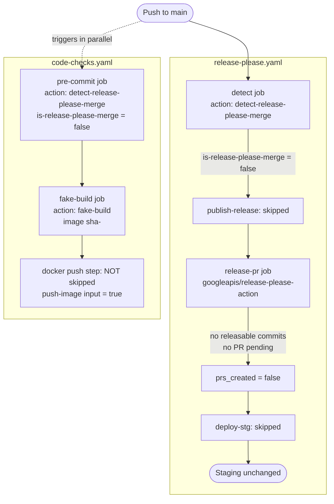
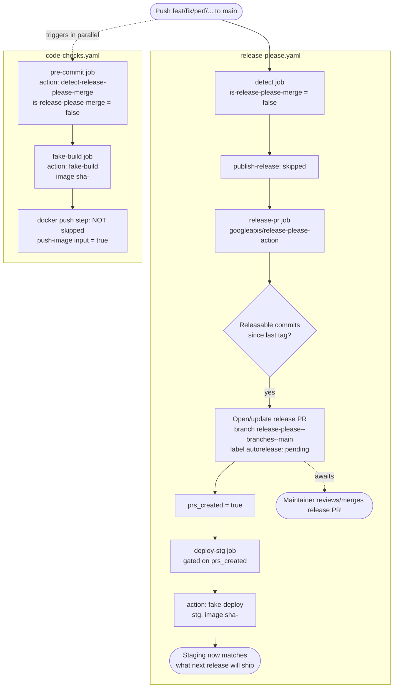
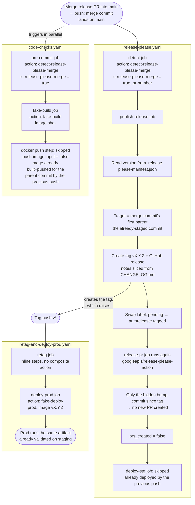

# Functional workflows

Visual summary of the three situations the CI in this repository handles:
an ordinary push, a push that becomes a release candidate, and the merge
that turns a candidate into a published release. See
[release-please default behavior](release-please-default-behavior.md) and
[staging deploy gating](staging-deploy-gating.md) for the detailed reasoning
behind each gate shown below, and
[fake build and docker push gating](fake-build-push-gating.md) for the
`code-checks` build/push details.

## 1. Normal push (no releasable changes pending/created)

## 2. Candidate release (a `feat`/`fix`/etc. push creates or updates the release PR)

## 3. Release created (release PR merged → tag/release → prod)

Also available: [manual deploy](manual-deploy.md)
(`deploy-manual.yaml`, `workflow_dispatch`) lets someone deploy any existing
tag to `stg` or `prod` on demand, independent of these three flows.
