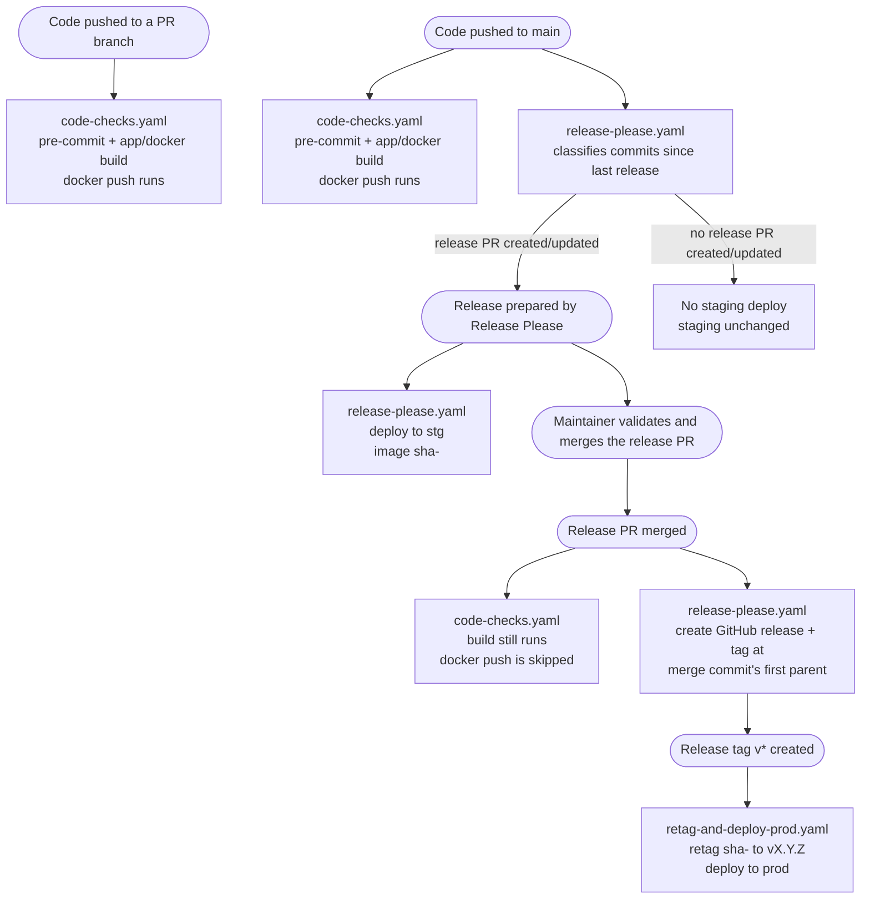
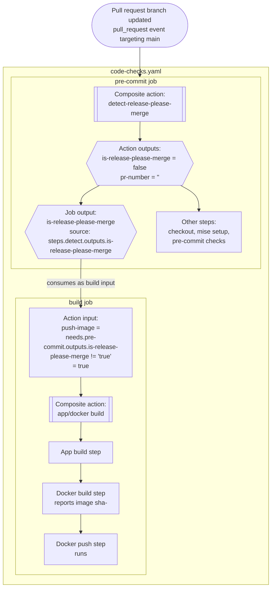
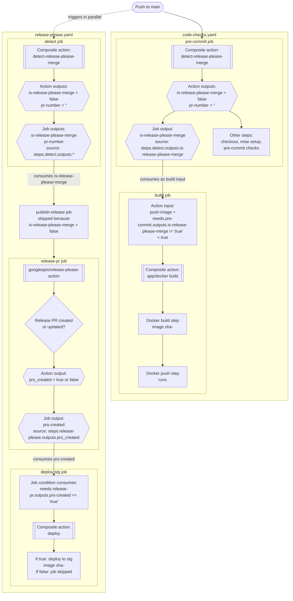
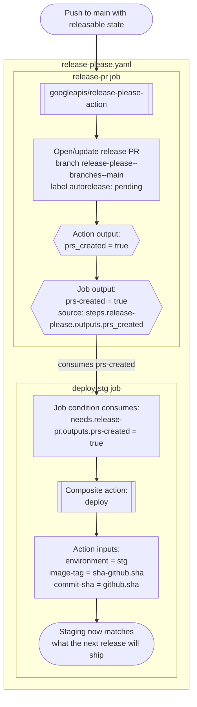
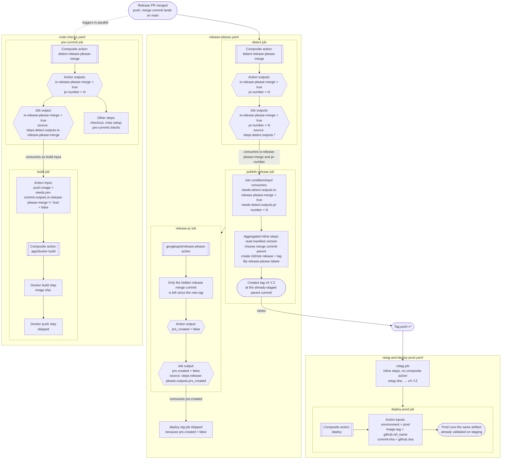

# Functional workflows

This page is an **explanation** of the release automation shape: it first gives
a broad view of what happens for each important event, then a detailed view of
which GitHub workflow, job, and composite action produces and consumes each
output.

See [release-please default behavior](release-please-default-behavior.md) and
[staging deploy gating](staging-deploy-gating.md) for the detailed reasoning
behind the release gates, and
[build and docker push gating](fake-build-push-gating.md) for the
`code-checks` build/push details.

## Big feature overview

## Detailed view

The diagrams below keep two levels of grouping:

1. workflow file (`code-checks.yaml`, `release-please.yaml`, ...);
2. job/action blocks inside the workflow.

Diamond-shaped output nodes show the relevant GitHub Actions outputs. Edges
labelled `consumes` show where one job output becomes another job's condition
or action input.

### 1. Code pushed to a PR branch

Only `code-checks.yaml` runs for a pull request branch update. The push becomes
a `pull_request` event (`opened`, `synchronize`, `reopened`, or
`ready_for_review`) targeting `main`; `release-please.yaml` is not triggered.

### 2. Code pushed to `main`

A push to `main` triggers both `code-checks.yaml` and `release-please.yaml`.
The code-checks side is the same as for a PR branch, but the release side may
either do nothing or prepare a release PR.

### 3. Release prepared by Release Please

This is the `prs-created = true` branch of the previous diagram. Release Please
has opened or updated the release PR, and the staging deploy runs for the same
commit.

### 4. Release created

Merging the release PR creates a push to `main`. That single push triggers both
`release-please.yaml` and `code-checks.yaml`. The publish job creates the
release tag at the already-staged parent commit; that tag push then triggers
`retag-and-deploy-prod.yaml`.

Also available: [manual deploy](manual-deploy.md)
(`deploy-manual.yaml`, `workflow_dispatch`) lets someone deploy any existing
tag to `stg` or `prod` on demand, independent of these flows.
