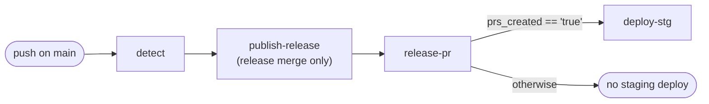
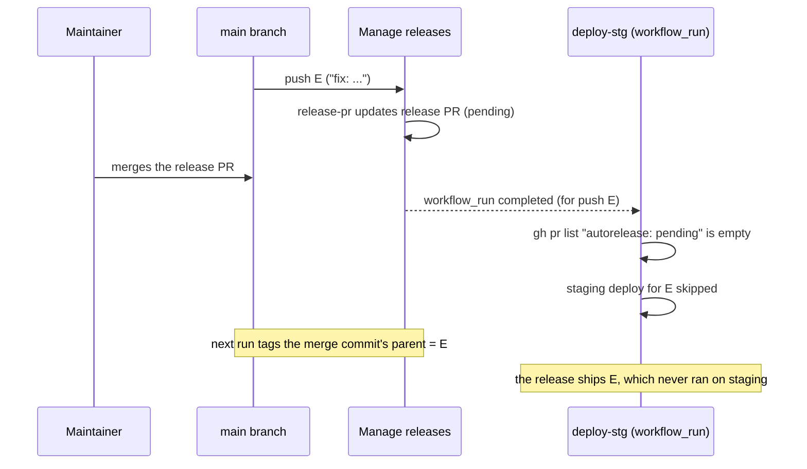

# Gating the staging deployment on releasable changes

Status: **studied, not implemented**. Today
[deploy-stg.yaml](../.github/workflows/deploy-stg.yaml) deploys every push to
`main` to staging, except the release PR merge commit (gated by the
[detect-release-please-merge](../.github/actions/detect-release-please-merge/action.yaml)
composite action).

## Goal

Deploy to staging **only when release-please would have created (or updated)
a release PR** for the push. The invariant to preserve is:

> Staging always matches what the next release will ship.

Modulo `CHANGELOG.md` and `version.txt`, which are out of sync with the
tagged tree by design — an accepted caveat of the
[release workflow](release-workflow-proposal.md).

Under this gate, a push that adds nothing releasable (e.g. only `chore` or
`test` commits, with no release PR pending) produces no staging deployment.
Staging then intentionally lags `main` HEAD — but it never lags what the next
release will ship.

## Two possible semantics — only one preserves the invariant

"Would have created a release PR" has two readings. They differ exactly when
a release PR is already pending and a non-releasable commit is pushed:

| Scenario on `main` | PR-exists semantics | This-push semantics |
| ------------------ | ------------------- | ------------------- |
| `feat` push, no PR pending | deploy (PR created) | deploy |
| `chore` push, no PR pending | skip (no PR) | skip |
| `chore` push, `fix` already pending | **deploy** (PR updated) | **skip** |

- **PR-exists semantics**: deploy iff, after this push, release-please has an
  open release PR (created or updated). The pending-`fix` case deploys, so
  staging tracks everything the next release will ship. This is the required
  semantics.
- **This-push semantics**: deploy iff the pushed commits alone are
  releasable. The pending-`fix` case is skipped, so the eventual release
  ships a `chore` commit that never ran on staging — the invariant breaks.

Every option below is evaluated against PR-exists semantics.

## Options considered

### Option 1: gate on the release-please outputs, same workflow (selected)

Move the `deploy-stg` job (with its `environment: stg` protection) into
[release-please.yaml](../.github/workflows/release-please.yaml), after the
`release-pr` job, gated on the release-please action outputs:

```yaml
deploy-stg:
  needs: [detect, release-pr]
  if: needs.release-pr.outputs.prs_created == 'true'
  environment: stg
```

The `prs_created` output of `googleapis/release-please-action` is `true`
when the action created **or updated** a release PR: exactly the PR-exists
semantics, computed by release-please itself against
[release-please-config.json](../release-please-config.json) — no duplicated
logic, no drift when the config changes.



Properties:

- **Subsumes the current merge-commit gate for staging**: on the push of the
  release PR merge commit, `publish-release` tags first (serialized by
  `needs`), then `release-pr` finds only the hidden `chore(main): release`
  merge commit since the tag, creates no PR, and the deploy is skipped —
  same effect as today's `detect-release-please-merge` gate.
- **No race**: the deploy decision is the decision of the very run that
  created or updated the PR, frozen in its output; the `manage-releases`
  concurrency group already serializes runs.
- **Fails closed**: if `detect` or `release-pr` fails, the deploy is
  skipped. Same philosophy as the existing gate: the failure mode is "a
  legitimate push does not reach staging", never "an unreleased commit
  ships"; re-running the workflow recovers.
- Cost: the staging deploy is serialized behind the release-please job and
  its concurrency group (some added latency), and `deploy-stg.yaml` loses
  its standalone `workflow_dispatch` trigger unless one is re-added on the
  merged workflow.

### Option 2: same signal, separate workflows (`workflow_run` + artifact)

Keep `deploy-stg.yaml` as its own file, triggered by `workflow_run` on
"Manage releases" completing. Same semantics and race-freedom as option 1,
with one catch: **`workflow_run` does not expose the triggering run's job
outputs**. The release-please workflow must export `prs_created` itself
(upload a small artifact that the deploy workflow downloads via
`github.event.workflow_run.id`), and the deploy workflow must dig the commit
to deploy out of `github.event.workflow_run.head_sha`.

Pure plumbing overhead over option 1; only worth it if the staging deploy
must live in its own workflow file for organizational reasons.

### Option 3: dry-run release-please in the deploy workflow

Keep the two workflows parallel and independent: `deploy-stg.yaml` runs the
release-please CLI (`npx release-please release-pr --dry-run`) and parses
its log output to decide whether a PR would be opened.

Rejected:

- Parsing log text is brittle across release-please versions (there is no
  structured "would release" output), and the CLI is pinned separately from
  the action.
- It re-computes the decision at a different moment than the real run, which
  opens the stale-tag race described below.

### Option 4: check for the open release PR after the fact

Trigger `deploy-stg.yaml` with `workflow_run` on "Manage releases"
completing, then ask GitHub whether a pending release PR exists **now**:

```bash
gh pr list --label "autorelease: pending" --state open
```

Attractive because the `autorelease: pending` label is a contract the
`publish-release` job already relies on, and no output plumbing is needed.
Rejected: it answers "is a release PR open at check time", a snapshot that
can diverge from the decision the run actually made — see the merged-PR race
below, which is the one race in this study that silently breaks the
invariant.

### Option 5: re-implement the commit classification

In `deploy-stg.yaml`, list commits since the last release tag and grep for
releasable conventional-commit types (`feat`, `fix`, `perf`, `revert`,
`BREAKING CHANGE`, `!`). Rejected: it is a parallel re-implementation of
release-please's rules that silently drifts when
[release-please-config.json](../release-please-config.json) changes, and the
"since the last tag" range depends on tag timing, so it inherits the
stale-tag race of option 3. The `before..sha` variant ("this push" range) is
worse: it implements this-push semantics and breaks the invariant outright.

## Race conditions, explicitly

### Option 4: the merged-PR window (breaks the invariant)

The check runs seconds to minutes after the push that triggered it. If the
release PR is merged inside that window, the snapshot lies:



The pushed `fix` is part of the tagged release, but its staging deployment
was skipped because the PR had already been merged when the check ran. This
is a silent violation of the invariant — nothing fails, staging is simply
missing a released commit.

The reverse window (release PR **closed without merging** between the push
and the check) also skips a legitimate deploy; it is recovered by the next
push (which re-creates the PR and deploys a HEAD containing the skipped
commit), with a residual risk if the PR is reopened manually and merged with
no intervening push.

### Options 3 and 5: the stale-tag window (benign for the invariant)

The dry-run (or the `git log`-based check) runs in the deploy workflow, in
parallel with "Manage releases" — outside the `manage-releases` concurrency
group that serializes tag creation. For a push landing after a release PR
merge but **before `publish-release` has created the tag**, "commits since
the latest release" is computed against the previous tag: the
already-released commits are counted again, and the gate answers "would
release" for a push that release-please itself (running after the tag
exists) does not consider releasable.

This produces **false positives only** (an extra staging deploy, never a
missed one), so the invariant holds — but the gate's purpose is defeated
exactly on the pushes that race a release.

### Options 1 and 2: no race

The gate is the output of the same run that created or updated the PR: the
decision and the state change are one atomic unit, and the
`manage-releases` concurrency group (no `cancel-in-progress`) serializes
successive runs. There is no window in which the deploy decision can
disagree with what release-please did.

The inherent stock-release-please race (a commit landing between the release
PR's last refresh and its merge) is unchanged by this study; it is analyzed
and mitigated (strict branch protection plus `always-update`) in the
[release workflow](release-workflow-proposal.md).

## Summary

| Option | Semantics | Race | Plumbing |
| ------ | --------- | ---- | -------- |
| 1: outputs, same workflow | PR-exists | none | none |
| 2: outputs, `workflow_run` | PR-exists | none | artifact + `head_sha` |
| 3: CLI dry-run | PR-exists | stale-tag (benign) | log parsing |
| 4: label snapshot | approximation | merged-PR (**breaks invariant**) | one `gh` call |
| 5: commit grep | depends on range | stale-tag + config drift | shell |

Option 1 is selected: it is the only approach where the gate **is**
release-please's own decision, made race-free by construction, and it
retires the `detect-release-please-merge` gate for staging as a side effect.
